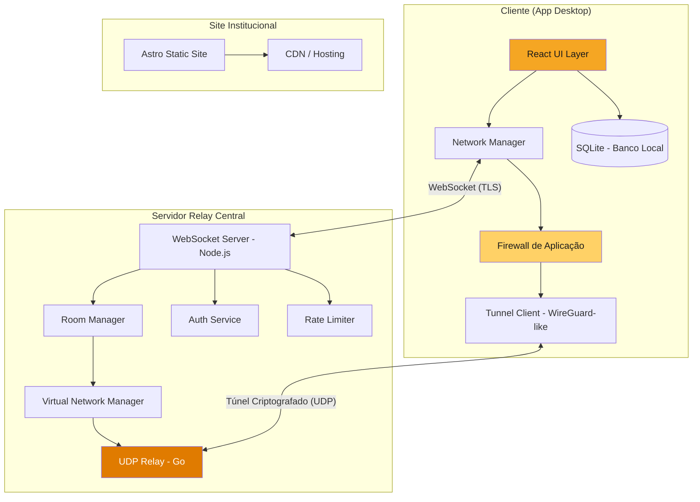
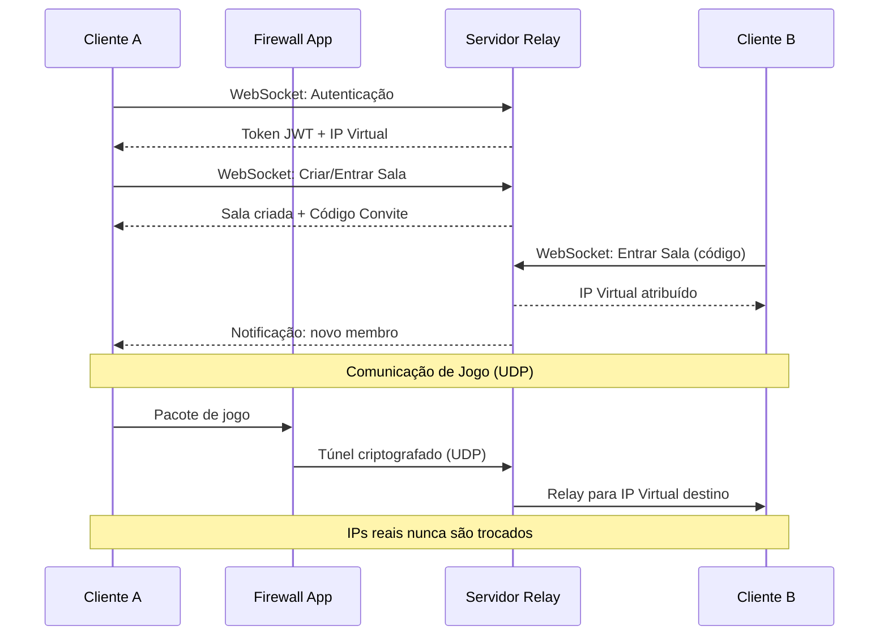

# Documento de Design — MelNet

## Visão Geral

O MelNet é um sistema composto por três componentes principais: um aplicativo desktop multiplataforma (Windows/Linux), um servidor relay central e um site institucional. O aplicativo permite que jogadores criem e entrem em salas virtuais que simulam redes LAN locais para jogos multiplayer, com foco em segurança — o IP real dos usuários nunca é exposto. O servidor relay intermedia toda comunicação entre clientes usando túneis criptografados, e o site institucional apresenta o produto e oferece downloads.

### Decisões de Design

- **Electron.js + React** para o app desktop: ecossistema maduro, suporte multiplataforma nativo, ampla comunidade. Tauri + Svelte seria mais leve, mas Electron oferece melhor compatibilidade com APIs de rede de baixo nível necessárias para o tunelamento.
- **Node.js com WebSocket** para o servidor relay: permite comunicação bidirecional em tempo real com baixa latência, essencial para listagem de salas e chat. Para o tunelamento de pacotes de jogo, um módulo em **Go** será usado como relay UDP de alta performance.
- **WireGuard-like protocol** para tunelamento: protocolo leve, criptografia moderna (ChaCha20-Poly1305), baixa overhead. Usaremos a biblioteca `wireguard-go` como base para criar túneis ponto-a-relay.
- **SQLite** para persistência local: leve, sem servidor, ideal para preferências e histórico.
- **Astro** para o site institucional: geração estática, SEO nativo, performance excelente, suporte a componentes interativos quando necessário.

## Arquitetura

### Diagrama de Arquitetura Geral

### Fluxo de Comunicação

### Modelo de Camadas

| Camada | Responsabilidade | Tecnologia |
|--------|-----------------|------------|
| UI | Interface do usuário, temas, componentes visuais | React + CSS Modules |
| Aplicação | Lógica de negócio, gerenciamento de estado | React Context / Zustand |
| Rede | WebSocket, gerenciamento de conexão | ws (Node.js client) |
| Segurança | Firewall, filtragem de tráfego, rate limiting | Módulo nativo (N-API) |
| Tunelamento | Criação e gerenciamento de túneis criptografados | wireguard-go binding |
| Persistência | Armazenamento local de preferências e histórico | better-sqlite3 |

